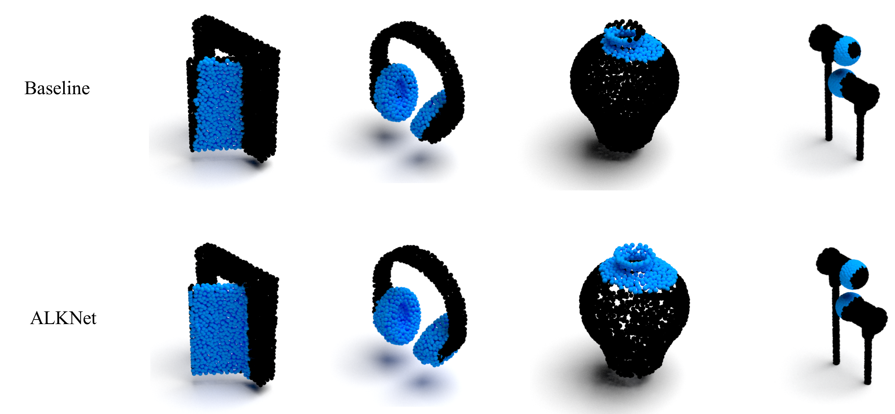
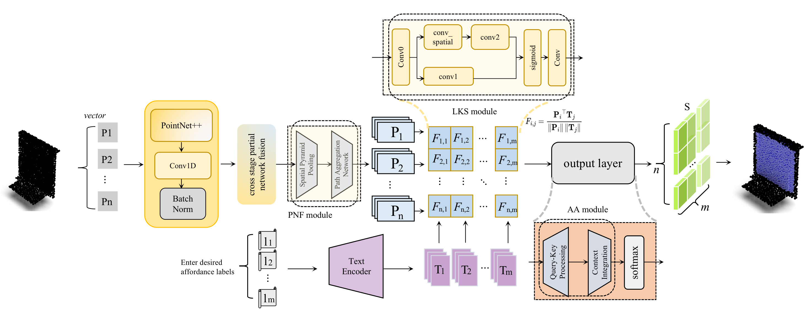

# ALKNet

We introduces ALKNet, a novel framework that integrates a multi-modal foundation model with 3D point cloud data to enhance open-vocabulary affordance detection.

Key innovations include the Large Kernel Selection (LKS) module, which captures hierarchical geometric details in point clouds, the Partial Network Fusion (PNF) module, which fusion the shallow and deep feature maps, and the Additive Attention module, which optimally combines multi-modal features.

## Getting Start

The rest of the parts are still undergoing preparation...